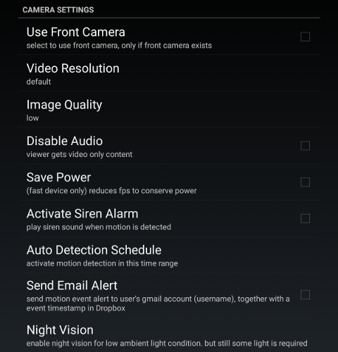

.. _camera:

Camera Settings
===============
| **Camera settings for Camera Mode Only. Viewer Mode takes the camera settings of that device**
|
| |user options|

Use Front Camera
----------------
Select to use the front camera, only if the front camera is available.

Video Resolution
----------------
| Choose an image resolution that gives the best performance.
| A higher resolution will demand a higher device computation resource (CPU power & memory) and requires more internet bandwidth.

Image Quality
-------------
| Choose low or high image quality
| High image quality settings will lead to higher internet bandwidth usage.

Motion Detection Sensitivity
-------------
| Choose high, Default, low sensitivity to trigger a motion event and record video.

Disable Audio
-------------
| You can disable audio to get a better video quality, such as a higher fps rate (frames per second).

Save Power
----------
| Some newer devices with a very fast CPU can produce a higher fps rate.
| However, running WardenCam on those devices will keep consuming power even if the device is actively being charged.
| Enable save power to reduce the fps rate and lower the kbps rate.  As a result, the device will not lose power while running as a
| surveillance camera.

Activate Siren Alarm
--------------------
| Enable this to generate a siren alarm when a motion event is detected.

Auto Detection Schedule
-----------------------
| To define a daily schedule to start/stop motion detection at predefined time(s).

Send Email Alert
----------------
| Enable this to send an email alert to user's WardenCam sign in Google email address. Use email alert only if a Google Dropbox account
| is linked.

Night Vision
------------
| WardenCam has a night vision algorithm to enhance image visibility during low ambient light conditions.
| Default option is "automatic" which means WardenCam will decide when to use night vision per the current ambient light conditions.
| You can also use "Always On" & "Always Off"

Auto-restart
------------
| Automaticly start WardenCam when a device finishes rebooting.
| WardenCam will sign in with the saved Google account information.
| You may want to enable this option on the camera device to improve reliability.
