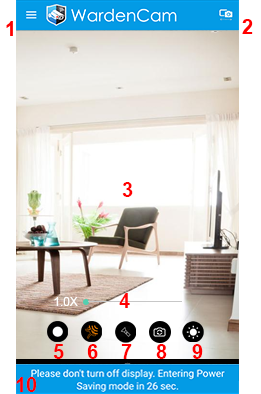

.. _cameramain:

Camera Main Screen
=====================
|camera| 
 
1. Camera Menu
---------------------------------------------
|  :ref:`cameramenu`

2. Switch to Viewer Mode
---------------------------------------------
|  This "camera" mode device switches to "viewer" mode.

3. Camera live view
---------------------------------------------
|  Shows the current camera view. Use this to ensure you are capturing the area you want.

4. Zoom
---------------------------------------------
|  Camera zoom

5. Record
---------------------------------------------
|  Records the video regardless of motion detection. This is 24/7 recording or until the the recording is disabled. 

6. Motion Detect
---------------------------------------------
| Turns on or off the camera's motion detect. When on, a red grid will appear. Select the red zone to start reginal motion detection. If motion is detected, Wardencam records the video to the cloud. The motion detection recording lasts as long as the motion continues.
|
| Free Users - up to 500 motion recordings
| Pro Users - up to 2000 motion recordings

7. Flashlight
---------------------------------------------
|  Turns on the LED light on the camera device remotely. Only the rear camera has the flash light.

8. Reverse Camera
---------------------------------------------
|  Switches between the rear and front cameras.

9. Exposure
---------------------------------------------
|  Adjusts exposure balance. A scale will appear when the button is pressed, to darken or lighten the image.

10. Turn off Display Message
---------------------------------------------
|  Screen will turn dark after a 60 second count down. Tap the screen to wake up the screen. For Android 8.0+ only.

