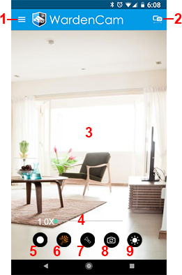

.. _camview:

Camera View
+++++++++++

| After signing in as camera, the camera view is opened.
| The camera view shows the current camera view. Use this to ensure you are capturing the area you want.
|
| |camAndroid|
|
Motion detection button |motiondetect|
-------------------------------------

| The first button (*shield button*) is the **motion detection button**.
| Click the button to enable motion detection.
| The button will **turn red if motion detection is enabled**.

Rename button |rename icon|
---------------------------

| The second button is to **rename the camera device**.
| The camera default name is the **device model name**.
| Rename the camera to a useful name such as “living room”, “front door”, “backyard", etc...
| After a new name is given, **restart** the camera mode to take effect.

Save energy button |energy icon|
--------------------------------

| For iOS devices, The camera view has a **save power button** instead of the rename button.
| After the camera mode starts, **please press the save power button to turn off the display**.
| To **exit camera view**, press the cross on the top right corner.
|
| |camIOS|
|

Tips
--------------

1. On android device, once the camera view is started, just press the
   *power button* to turn off the display. Avoid pressing home button.
   It is not recommended to run camera view in the background.
2. On iOS devices, just press the *save power button* to turn off the
   display. **Don’t press the power or home button on iOS devices**,
   otherwise the camera hardware will be forced to close.

.. |motiondetect| image:: img/motiondetect.png
   :width: 32pt
.. |rename icon| image:: img/name.png
   :width: 32pt
.. |energy icon| image:: img/energy.png
   :width: 32pt

.. |camIOS| image:: img/camIOS.png
   :width: 400pt
