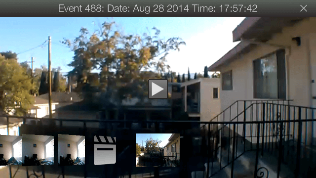
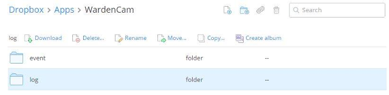
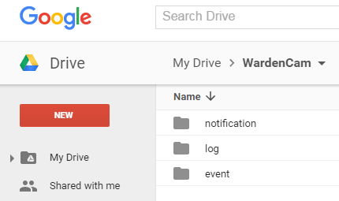

.. _cloudview:

Cloud View
=========
| Cloud view is opened from the Viewer screen by selecting the red flag icon |motionflag icon| or the video log icon |videolog icon|.
.. |motionflag icon| image:: img/motionflag.png
  :width: 20pt
  .. |videolog icon| image:: img/videolog_icon.png
  :width: 30pt
| Cloud view screen shows *24/7 video logs* and *motion detection recordings*, depending on how the view is opened.
| Both the camera and viewer **should be linked to the same Google Dropbox account**!
|
| |cloud view|

|
Date and time
-------------
| The date and time of the event is shown in the title of the cloud view screen.
| Pan the video gallery left and right to search across all videos.

Play and pause
--------------
| Press the triangle play button to start the video replay.
| Press the button again to pause the replay.

Delete video(s)
---------------
| Long press a video clip.
| You will see a pop up menu with two options:
- *delete one video*
- *delete all videos*

Tips
--------------
1. The video logs are saved in “*\apps\wardencam\log*" folder in your Dropbox or Google Drive.
2. Motion recordings are saved in “*\apps\wardencam\event*" folder in your Dropbox or Google Drive.
3. The cameras and viewer **should be linked to the same Dropbox or Google drive account!** 
|

| Example Website view of a Dropbox with wardencam videos
| |dropbox folder|

| Example Website view of a Google Drive with WardenCam videos
| |googledrive folder|

