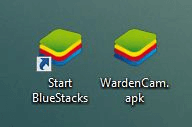
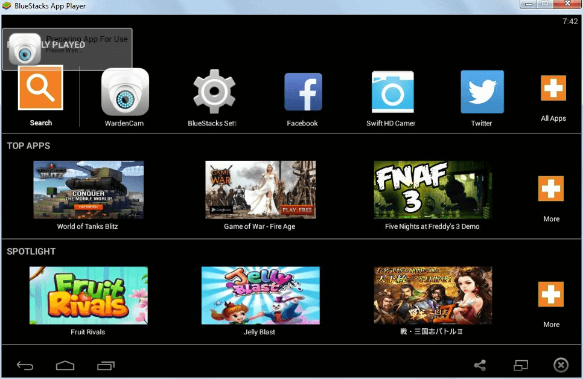

.. _faq:

FAQ
===

What is the minimum Hardware reqirement?
++++++++++++++++++++++++++++++++++++++++
| Android: 1GHz CPU + 512MB RAM, OS 2.3+
| iOS: iOS7 and above

How to start monitoring?
++++++++++++++++++++++++
| You just need to install the app on two devices. Then sign in with a google account. Select "Cam" to use the device as a camera. Select "View" to receive video and audio live streaming. Motion detection recording and 24/7 recording can be achieved once you link your Dropbox account.
| Watch the `demo video`_
.. _demo video: https://www.youtube.com/watch?v=UObAA8vslXU

Failed to sign in?
++++++++++++++++++
| If you failed to sign in with an existing account, make sure the username and p/w are correct and the account is not protected by google 2-step verificaition.
| If using a public network, make sure "secure port" option is used.
| You may also create a new google account dedicated for surveillance use.

How to start recording?
+++++++++++++++++++++++
| Enable 24/7 recording in settings. Click Dropbox icon. Authorize WardenCam to create a folder "apps\wardencam".
| Link the same Dropbox account on both the camera and the viewer.
| All 24/7 video log and motion event recordings will be uploaded to this folder.

How to improve image quality / FPS?
+++++++++++++++++++++++++++++++++++
| There are a few options in camera settings to improve image quality and frame rate.
* Use a higher image resolution
* Enable high image quality
* Disable audio

How to make WardenCam work with a slow network?
+++++++++++++++++++++++++++++++++++++++++++++++
| If the internet speed is low, namely the internet bandwidth is limited, you want to relax the video settings through the followin camera options.
* Use a lower image resolution
* Enablw low image quality
* Enable save power

Red exclamation mark?
+++++++++++++++++++++
| Red exlamation mark means peer to peer connection is not established.
| Some network configuration and mobile carrier can disable the peer to peer feature for various reasons.
| In this case, the communication mode will change to server based.
| You may experience a drop in video and audio quality and a less reliable connection.
| At the same time, you need to keep the kbps lower than 50 kbps to maintain connection.

How to reduce kbps?
+++++++++++++++++++
| You can reduce kbps (network bandwidth utilization) through the following camera options.
* Use a lower image resolution
* Enable low image quality
* Enable save power

My device is losing power?
++++++++++++++++++++++++++
| A powerful phone can deliver a high fps; but also drain lots of power.
| If the battery is running out even when the phone is being charged, please check "save power" option in settings.

Why do I need a SD card?
++++++++++++++++++++++++
| Recordings are saved in the SD card before uploaded to Dropbox.
| Unmount SD card will disable recording.
| For devices without a SD card, only 15 mins trial is allowed. Trial time will be restored once the SD card is installed.

How to request more trial hours?
++++++++++++++++++++++++++++++++
| Just email the develper wardencam360@gmail.com and ask for more trial hours to testing.
| Completely free!

How to use multiple devices as cameras?
+++++++++++++++++++++++++++++++++++++++
| Sign in with the same google account on multiple devices as cameras.
| On the viewer, you will see a list of available camera from the vistapoints drop down list.

How to purchase the upgrade?
++++++++++++++++++++++++++++
On Android:
----------
| Click the info button (2nd button on the sign in screen)
| Scroll down. You will see the "upgrade me" button
On iOS:
------
| Click the shuttle button (3rd button on the sign in screen)
| You will then see the in app purchase dialog
|
| You can purchase through google play store and iOS store. Email support if the purchase is not available.
| Only the camera device requires the upgrade to run for 24/7. Make sure you upgrade on the camera device first.
| The upgrade is tied to your google play / apple account.

I purchase the upgrade on my Android device. How do I enable the upgrade on my other Android devices?
++++++++++++++++++++++++++++++++++++++++++++++++
| You only need to purchase the upgrade once for your all Android devices.
| The upgrade is linked to your google play account. The purchase can be recognized on all your Android devices as long as they have the same google play account in sync.
| It is preferred to upgrade first on the camera device instead of the viewer device.

I purchase the upgrade on my iOS device. How do I enable the upgrade on my other iOS devices?
++++++++++++++++++++++++++++++++++++++++++++++++
| You only need to purchase the upgrade once for your all Apple devices.
| The upgrade is linked to your iTunes account. The purchase can be recognized on all your Android devices as long as they have the same apple account in sync.
| It is preferred to upgrade first on the camera device instead of the viewer device.

Can I transfer my purchase between iOS and Android?
++++++++++++++++++++++++++++++++++++++++++++++++
| WardenCam360 for Android and WardenCam360 for iOS are two separate products and you can not transfer purchases between the two platforms. You'll have to purchase the iOS and Android version of WardenCam360 separately if you plan to use it on both platforms.
| Once you purchase WardenCam360 for iOS you can freely transfer it to any of your iOS devices (iPad, iPhone or iPad) as long as they are connected to the same iTunes account. The same goes for Android - purchasing it once from the Google Play Store gives you the ability to transfer the purchase to all your other Android devices linked to the same Google Play account.

What if I upgrade on the viewer device first?
+++++++++++++++++++++++++++++++++++++++++++++
| If you upgrade on the viewer device, you just need to manually enable the upgrade on the camera device once.
| Before you manually upgrade the camera device, it is still running as the trial.
| The manual enable procedure is simply to sign in once on the camera device as a camera or a viewer.

How to run WardenCam on a Windows PC?
+++++++++++++++++++++++++++++++++++++
| BlueStacks is an Android simulator which allows you to run WardenCam on your PC.
* Download and install `BlueStacks`_
* Download WardenCam installation file `WardenCam.apk`_
* After you finish the previous two steps. You should see these two icons.
| |bluestacks install|
|
* Next double click WardenCam.apk file to install WardenCam inside BlueStacks.
* After you finish the installation, double click "Start BlueStacks" to run BlueStacks App Player.
* You should see WardenCam appears in BlueStacks App Player running on your Windows PC.
| |app player|
|
* Open WardenCam inside the app player. You can get all WardenCam functionality as if you are running it on an Android device!
| |app wardencam|

More questions?
+++++++++++++++
| Email the developer support@wardencam360.com.
.. _BlueStacks: http://www.bluestacks.com/download.html
.. _WardenCam.apk: http://bit.ly/1yERYLH

.. |app wardencam| image:: img/wardencam.png

