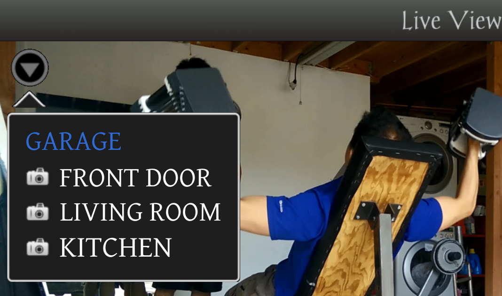
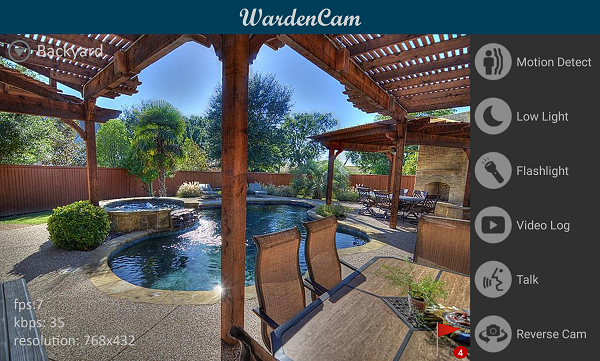

.. _liveview:

Live View
=========

| After signing in as viewer, the live view is then opened.
| The live view shows the **live streaming from the connected camera device, the status of the camera device, a list of available cameras, and a few control buttons**.
|
| |liveview|
|
Motion detection button |shield icon|
-------------------------------------

| The first button is the motion detection button.
| It allow the viewer to remotely turn on & off the motion detection
  function.
| If motion detection is already enabled, the button will turn red.

Cloud recording button |cloud icon|
-----------------------------------

| If a Dropbox account is linked, the cloud button opens the cloud view
  and shows all the video logs.
| Video logs are different from motion detection recording.
| Motion detection recording is triggered by a motion event; while video
  logs are enabled by “24/7 recording” in settings. Once enabled, the
  camera will continue logging nonstop.

LED button |led icon|
---------------------

| Toggle the flash LED light on the camera device remotely.
| Only the rear camera has the flash light.
| LED button turns yellow if the LED is turned on.

Two way audio button |microphone icon|
--------------------------------------

| Hold the audio button and talk.
| Release the button to send the voice to the camera device.

Motion detection flag button |motion flag|
------------------------------------------

| This button shows the number of detected motion events.
| If a Dropbox account is linked, the motion flag button opens the cloud
  view and shows all the motion detection recordings.

Battery icon |battery1| |battery2|
----------------------------------

| Shows the battery power percentages and charging status.
| The right icon shows the device is being charged.

P2P connection icon |p2p1| |p2p2|
---------------------------------

| Shows the peer to peer connection status.
| Red exclamation mark indicates peer to peer connection has failed.
| Additional precautions are required if P2P connection failed.

Vistapoints
-----------
|
| |vistapoints|
|
| Vistapoints shows a list of available camera devices.
| Clicking on a camera name to connect to a different camera device.
| To add another camera, just sign in with the same google account.

fps, kbps, & resolution
-----------------------

| fps = frames per second
| kbps = kilo bytes per second
| resolution = image resolution in pixels

Developer tips
--------------
1. Live video are normally streamed via peer to peer connection. No
   third party is involved to handle the video stream.
2. Pay extra attention to the P2P connection icon. P2P failure is
   normally due to mobile data carrier blocking P2P connection.
3. Depending on the image settings and camera device hardware speed,
   viewer may expereince a couple seconds of delay. This should not be
   an issue if motion detection recording is enabled.

.. |shield icon| image:: img/shield_icon.png
   :width: 32pt

