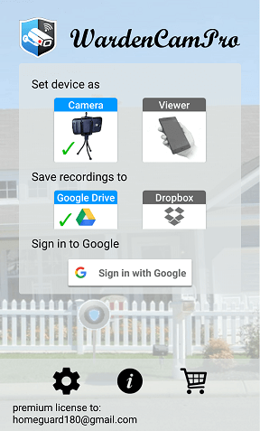
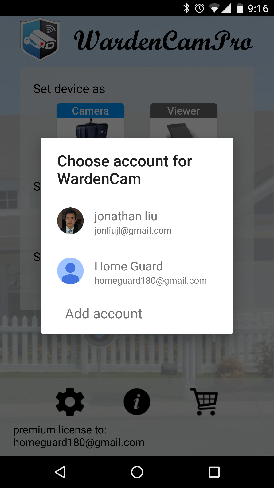
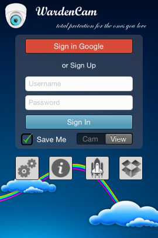
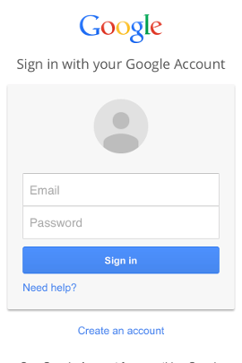

.. _mainscreen:

Main Screen
+++++++++++
| |WCmainscreen|

Set Device As Modes
----
| **Camera** Mode Button will set the device as a Camera. When signing in, the device will enter the :ref:`camview`. You can have multiple devices set as camera mode. Place these devices around your home or office for monitoring.
|
| **Viewer** Mode Button will set the device as a Viewer. When signing in, the device will enter the :ref:`liveview`. This is the device that you carry with you, such that you can live stream and watch your home or office from anywhere.
|
Cloud Storage
-----
Google Drive and Dropbox are free cloud storage providers up to a few GBs. This is more than enough to store months of motion detected recordings in the cloud. We respect your privacy, no videos are stored on wardencam servers, and wardencam only has access to the wardencam folder within your cloud drive. To View your cloud recordings, sign in as Viewer and select "View Recordings"( See :ref:`cloudview` screen). 

**Google Drive** Button will save the recordings to your Google Drive > Wardencam folder.

**Dropbox** Button will save the recordings to your Dropbox > Wardecam folder.

Signing In
----

Google Sign in Credentials are used to link your cameras and viewers over the internet. We value your privacy; Google sign in is a trusted, safe, and secure way for you to keep your live streaming camera and recorded camera videos private.

To sign in WardenCam, you can create a new account for surveillance use or sign in with an existing google account.

|  |Sign in android2|

Sign in with a new or existing Google account
^^^^^^^
* Select **“Sign in with Google”** button
* The prompt shows your existing Google Accounts associated with your device, with an Add Account option. Select the Google Account you want associated to WardenCam.
**Please note** Your WardenCam Camera and Viewer devices must be on the same Google Account to view live streaming, and recorded videos

iOS sign in
^^^^
| Sign in the iOS app is almost the same as the Android app.
| The difference is that when you **sign in via a google account**, you always need to authorize the account via **google authentication webpage** as least once.

| |Sign in ios1| |Sign in ios2| 

Developer tips
^^^^
1. To avoid entering the account and password all the time, You may check “save me” to remember the account sign in.
2. If you are using a public network, *such as “company network, school network, store network”*, you may want to enable **“secure port” in settings**.

User Options  |user_options|
----
.. |user_options| image:: img/user_options.png
   :width: 20pt
See :ref:`UserOption` 

Info |info|
----

Store |cart|
----

Purchase the App and other accessories at our online store

