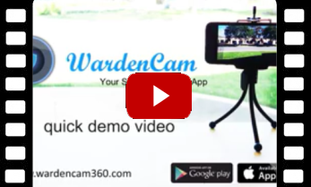

.. _overview:

Overview
===============

WardenCam App is quick and simple to use. Install the app on
two smart devices (*android phones/tablets, iphone/ipad…*). Sign in with
any google account on one as “camera” mode and the other as “viewer” mode, Motion
detection recording and 24/7 recording are features available when you link your
Dropbox account.

Where can I Download the App?
+++++++++++++++++

WardenCam works on both Android and iOS devices.
Here is the link to download from `Google Play Store`_ and `iTunes
store`_.

**Do not buy an expensive IP camera or home surveillance system**
Use your spare iphones and android phones and tablets with the WardenCam App to transform
into an advanced, easy to use, surveillance camera.

WardenCam is **free to try** for 24 hours. If you like the app, please upgrade and buy the premium version for $5.99.

Technical Support
+++++++++++++++++
Please visit our FAQ. Most of the questions and issues can be answered quickly looking through the FAQ section.
Otherwise, We will do our best to respond with 1-2 business days.
 email: *support@wardencam360.com*

Demo Video
+++++++++++++++++
| Watch WardenCam `demo video`_

.. _Google Play Store: https://play.google.com/store/apps/details?id=com.warden.cam
.. _iTune store: https://itunes.apple.com/app/id914224766
.. _demo video: https://www.youtube.com/watch?v=UObAA8vslXU
