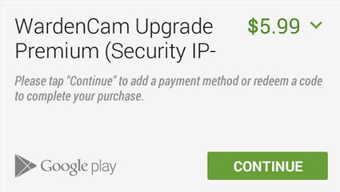
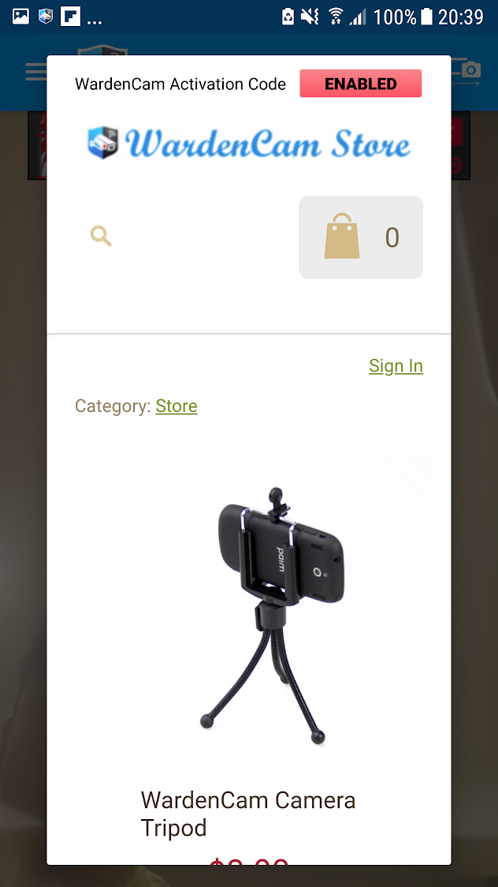
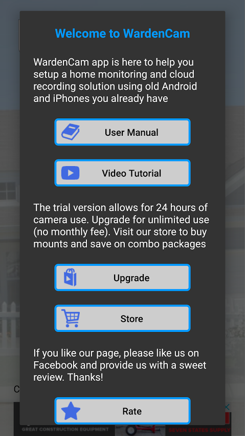

.. _trial&upgrade:

Trial & Upgrade
===============
| WardenCam is **free to try and test**. It come with a trial license valid for a limited number of days. Only after you completed the testing on your devices, you may upgrade to the premium version for a small & once only fee ($5.99 per US customer).

Trial
-----
- Start the testing with your home WiFi network.
- Then make sure the viewer can connect externally with another WiFi or your mobile data network.
- Test the Dropbox integration and video replay.
- If you need more time to complete your test, please feel free to email support@wardencam360.com and ask for more trial time.

Upgrade
-------
| |iap|

- If google play store / apple app store is available in your country, it is the easiest way to upgrade through in app purchase.
- If in app purchase is not available, you can email support@wardencam360.com for alternative purchasing method.
- Once purchased the upgrade is linked to your google play / apple account. You can enable all devices.
- Viewer function is always free and not limited by a timer. If you like to provide the viewing capability to your families/friends, you can do so for free.

Manual Upgrade Procedure
------------------------
- Enable the alternative method in "WardenCam Pro Store" (see the red "ENABLED" button. Press the button once if it is grey).
| |store enable|

- Goto "Welcome Screen" and press "Upgrade" button
| |user guide|

- Send purchase request via email. We will then reply you with the activation code.