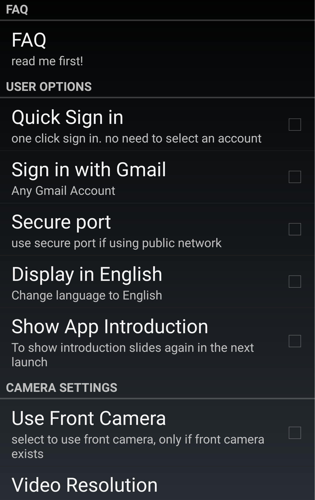

.. _useroption:

User Options
============
|
| |user options|
|

FAQ
------------------
| Frequently asked questions about setting up and using Wardencam features

Quick Sign in
------------------
| If you would like to keep google account linked and not be prompted which google account to choose every login, select this.

Sign in with Gmail
------------------
| If you would like to sign in with a google account not associated with your device, select this.

Secure Port
-----------
| Enable this option when you sign in with a public network such as a company network, schoold network, store network..

Display in English
------------------
| Enable this control if you prefer to overwrite the system language and use English representation for non-English WardenCam Apps. 

Show App Introduction
---------------------
| Displays app introduction slides upon app restart

Tips
--------------
1. During the sign in step, if you repeatedly get "time out" error, it will be a good idea to enable "secure port" in settings.
2. If you enable "Auto-restart", please expect for a few minutes delay between the device reboot and camera getting ready to connect.
