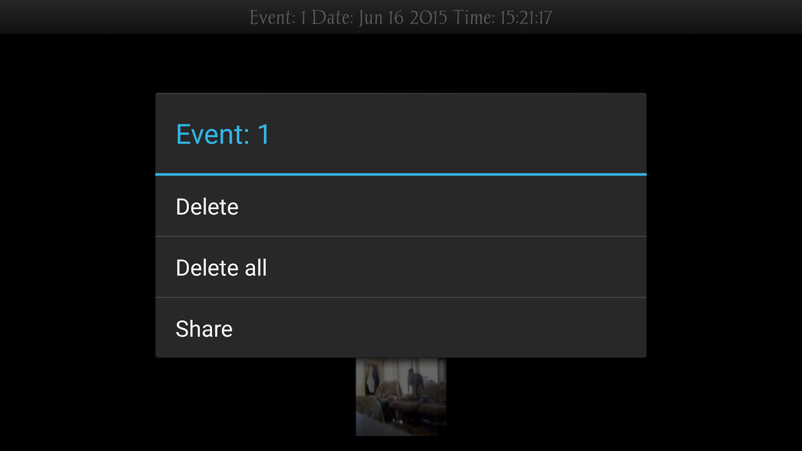
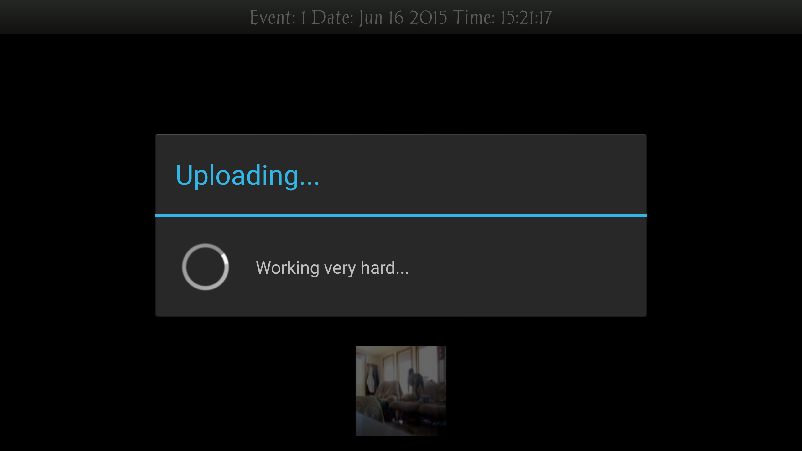
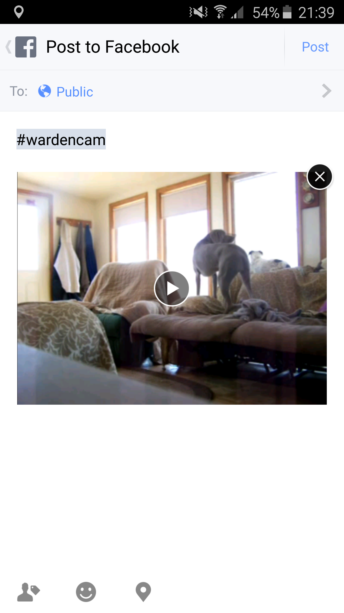
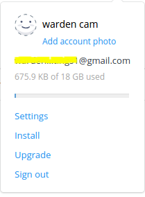

.. _videochallenge:

Most Liked Video
===================
- To participate in this challenge, you will have a chance to win **a free Dropbox account with lifetime 18GB storage space**
- In this challenge, simply share a motion detection recording and post it on facebook.
- The facebook post with **the most likes** from the WardenCam fan page and user's facebook page wins the prize.

How to Participate
------------------
- Go to "User Guide"
| |user guide|
.. |user guide| image:: img/user_guide.png
  :width: 240pt

- Press "facebook" icon in the "Win a Prize" section
| |challenges|
.. |challenges| image:: img/challenges.png
  :width: 240pt

- Press "Challenge 2: Most liked video". You will then prompt to the recording playback screen.
| |cloudview share|

- Long press the video clip that you like to use for the challenge and then click "share" button.
| |upload video|

- Once the video is uploaded, a facebook share dialog is shown.
- **Don't forget to type "#wardencam"** in the post.
- Press "post" button. You are now in the competition to win the free 18GB Dropbox account.
| |share video|

Redeem the Prize
----------------
- The winner will be annouced on WardenCam facebook fan page and contact directly through facebook messenger.
- The login credential of the 18GB Dropbox account will be provided to the winner.
| |dropbox account|

