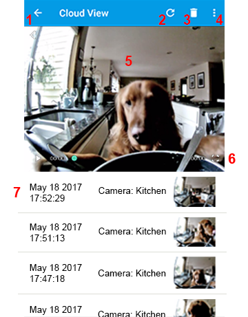

.. _viewercloud:

Cloud View
===========

| Cloud view is opened from the Viewer screen by clicking the cloud icon 

|cloud view|

1. Back Button
---------------------------
|	Back to the main viewer :ref:`viewermain`
|

2. Refresh 
---------------------------
| 	Checks your Google Drive or Dropbox for new videos
|
3. Trash Can
---------------------------
|	Deletes the selected video.
|
4. Options
---------------------------
* Reverse Order - reverses the video list order by date.
* Share - share your video

5. Watch a Recorded Video
--------------------------- 
|    
6. Full Screen
---------------------------
|  Toggles between portrait and landscape modes for a larger viewing experience.
|
7. List of Recorded Videos
---------------------------
|  Videos are sorted by date and camera name. Select a video to watch.
|

Tips
--------------
1. Manual recordings are saved in “*\\wardencam\\log*" folder in your dropbox or google drive.
2. Motion recordings are saved in “*\\wardencam\\event*" folder in your dropbox or google drive.
3. The cameras and viewer should be linked to the same Dropbox or Google Drive account! 
4. You can also watch, download and delete your videos from your Google Drive or Dropbox website. See :ref:`web`

