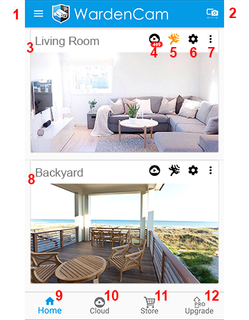
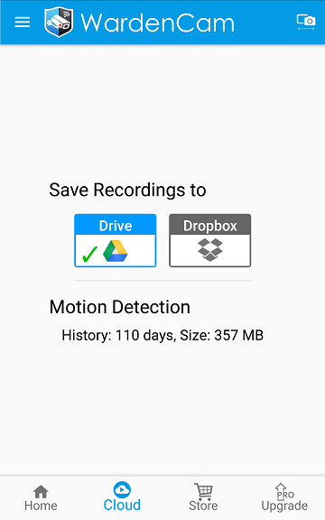

.. _viewermain:

Viewer Main Screen
===================

| After signing in as viewer, the viewer main screen is opened. This is the central console to configure your account and control your cameras.
|
| |liveview|

|

1. Menu
-----------
| :ref:`viewermenu`

2. Switch to Camera Mode
-------------------------------
|  This "viewer" mode device switches to "camera" mode.
   
3. Camera Card 1
-------------------------------
|  "Camera" mode devices that are linked to the same Google account, show up as cards. The image is a snapshot of what the camera is seeing. Click the image to go to :ref:`viewerlive`.

4. Cloud Recordings
-------------------------------
|  Views the :ref:`viewercloud` recordings from this camera. Another method to view your recordings is from your pc/mac browser login to either drive.google.com or dropbox.com and go to the wardencam folder. This is the ONLY place where your videos are stored.

5. Motion Detect
-------------------------------
|  Toggle motion detect on or off. Orange is on. Black is off. Motion detect will record video whenever motion is detected in this camera.

6. Camera Settings
-------------------------------
|  Configure this camera's settings. Every camera has its own :ref:`camerasetting`.

7. Card Options
-------------------------------
|  Organize your cards with deleting or pinning the card.

8.  Camera Card 2 
-------------------------------
|  The next camera will show up here. Wardencam auto detects for cameras linked to your google account. Camera cards will continue to appear as cameras are connected to this google account.

9.  Home 
-------------------------------
|  It's this page, the viewer main screen.

10. Cloud Settings
-------------------------------
|  General cloud settings. You can change between Google Drive and Dropbox
|  |viewercloudcontrol|

11. Store
-------------------------------
|  Place you can buy accessories if the Google Play Store or Apple App Store doesnt work. `Visit our Store <https://www.ecwid.com/store/wardencam360/>`_

12. Upgrade
-------------------------------
|  An easy way to upgrade for full features, and no limit. See  :ref:`trialupgrade` for more information.

